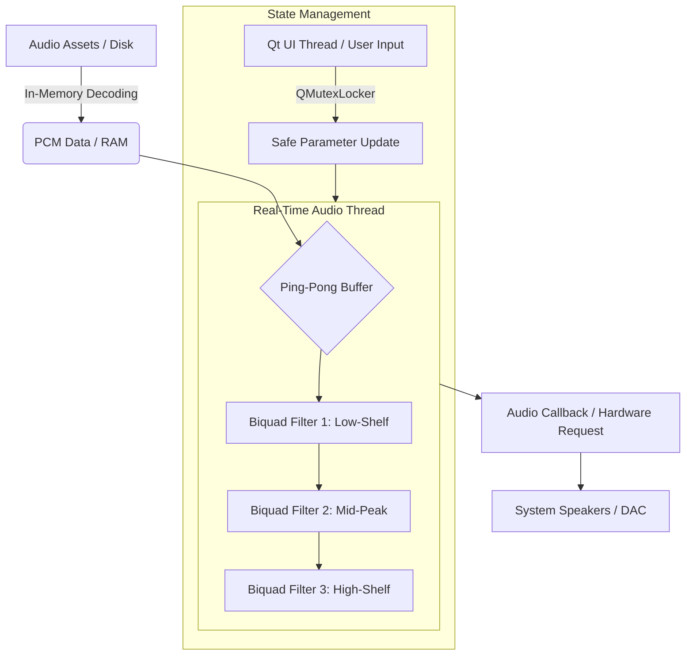

# Sonus Flow (Rust)
**High-Performance Auditory Training Infrastructure for APD**

> **Development Status:** This is the primary, active repository for SonusFlow, rewritten from the ground up in **Rust**. It succeeds the legacy C++/Qt6 implementation to leverage superior memory safety and real-time thread guarantees.

---

---

## ⚠️ Medical Disclaimer
Sonus Flow is a **technical prototype** and is currently in a Pre-Alpha state. It has not been clinically validated and is not intended for use as a diagnostic or therapeutic tool for Auditory Processing Disorder (APD). **Always consult with a qualified Audiologist or medical professional before beginning any auditory training regimen.**

---

## System Vision
Auditory Processing Disorder (APD) is a neurological condition where the brain struggles to interpret sound, particularly in "Cocktail Party" environments where the signal-to-noise ratio is low. 

**Sonus Flow** is an engineered solution designed to facilitate auditory discrimination training via controlled, simulated environments. By leveraging **neuroplasticity**, the application provides a modular platform for practicing voice isolation amidst complex background soundscapes.

## Engineering Highlights (Rust Implementation)

* **Memory-Safe Audio Pipeline:** Leveraging Rust’s ownership model to ensure that the audio buffer is never subject to data races, providing a more stable foundation than traditional C++ pointers.
* **Low-Latency cpal Backend:** Utilizes the **cpal** (Cross-platform Audio Library) crate for high-performance, low-level access to ALSA (on Linux) and other host audio APIs via a pull-based callback system.
* **Modern Declarative UI:** Built with **Slint**, allowing for a lightweight, hardware-accelerated fluid interface that stays responsive even under heavy DSP loads.
* **Binaural DSP Architecture:** Designed to support real-time HRTF (Head-Related Transfer Function) spatialization, allowing users to practice "spatial release from masking"—a critical skill for APD management.
* **Subtractive-Only DSP Chain:** Features a professional-grade 3-band biquad equalizer (low-shelf, peaking, high-shelf) designed with a **subtractive-only constraint** to promote vocal clarity while protecting user hearing.

## High-Performance Audio Architecture
The application is designed around **Lock-Free Data Decoupling** and hardware-dictated timing to ensure professional-grade reliability.

* **Pull-Based Callback:** The hardware "pulls" data from the Rust audio thread, eliminating the stutters and "pops" associated with CPU-bound push models.
* **Real-Time Thread Priority:** The DSP engine is isolated from the Slint UI thread, ensuring that graphical updates never block the audio callback.
* **Type-Safe DSP:** Utilizing Rust's type system to ensure buffer integrity and minimize the risk of digital clipping.

The following diagram illustrates the signal path and thread boundaries:

---

## 🚀 Future Roadmap
To move Sonus Flow from a prototype to a clinically viable tool, the following technical milestones are planned:

* **Integrated Peak Limiting & LUFS Metering:** Implementing an ITU-R BS.1770-4 compliant loudness metering system and a transparent look-ahead limiter to ensure all training assets adhere to safe output standards.
* **Neural Voice Isolation (AI Integration):** Integrating lightweight machine learning models (via Tract or ONNX) to provide real-time voice-from-noise isolation.
* **Spatial Audio Implementation (HRTF):** Moving from stereo to true binaural spatialization to simulate 3D environments.
* **Session Telemetry & Progress Tracking:** Development of a local, encrypted SQLite database to track user performance metrics over time.

---

## Developer Status
The project is currently in the early architectural phase. Build instructions will be provided once the MVP (Minimum Viable Product) reaches a stable build state.

### Tech Stack Migration
| Feature | Legacy (C++) | New (Rust) |
| :--- | :--- | :--- |
| **Audio Engine** | MiniAudio | cpal |
| **UI Framework** | Qt 6 | Slint |
| **Safety** | Manual Memory Management | Memory & Thread Safety (Borrow Checker) |
| **Build System** | CMake | Cargo |
